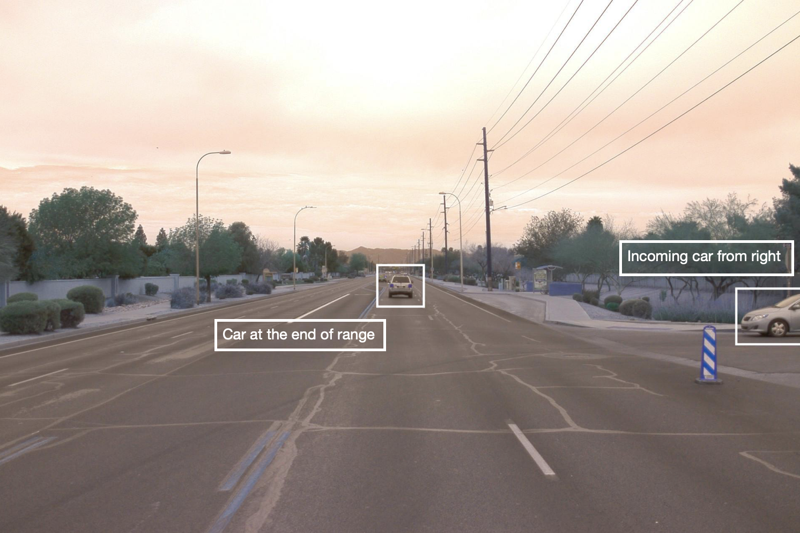

# 3D Object Detection

The project consists of two major parts: 
1. **Object detection**: In this part, a deep-learning approach is used to detect vehicles in LiDAR data based on a birds-eye view perspective of the 3D point-cloud. Also, a series of performance measures is used to evaluate the performance of the detection approach. 
2. **Object tracking (Future work)** : In this part, an extended Kalman filter is used to track vehicles over time, based on the lidar detections fused with camera detections. Data association and track management are implemented as well.

## Project File Structure

📦project 
 ┣ 📂dataset --> contains the Waymo Open Dataset sequences  
 ┃ 
 ┣ 📂misc 
 ┃ ┣ evaluation.py --> plot functions for tracking visualization and RMSE calculation 
 ┃ ┣ helpers.py --> misc. helper functions, e.g. for loading / saving binary files 
 ┃ ┗ objdet_tools.py --> object detection functions without student tasks 
 ┃ ┗ params.py --> parameter file for the tracking part 
 ┃  
 ┣ 📂results --> binary files with pre-computed intermediate results 
 ┃  
 ┣ 📂student  
 ┃ ┣ association.py --> data association logic for assigning measurements to tracks incl. student tasks  
 ┃ ┣ filter.py --> extended Kalman filter implementation incl. student tasks  
 ┃ ┣ measurements.py --> sensor and measurement classes for camera and lidar incl. student tasks  
 ┃ ┣ objdet_detect.py --> model-based object detection incl. student tasks  
 ┃ ┣ objdet_eval.py --> performance assessment for object detection incl. student tasks  
 ┃ ┣ objdet_pcl.py --> point-cloud functions, e.g. for birds-eye view incl. student tasks  
 ┃ ┗ trackmanagement.py --> track and track management classes incl. student tasks   
 ┃  
 ┣ 📂tools --> external tools 
 ┃ ┣ 📂objdet_models --> models for object detection 
 ┃ ┃ ┃ 
 ┃ ┃ ┣ 📂darknet 
 ┃ ┃ ┃ ┣ 📂config 
 ┃ ┃ ┃ ┣ 📂models --> darknet / yolo model class and tools 
 ┃ ┃ ┃ ┣ 📂pretrained --> copy pre-trained model file here 
 ┃ ┃ ┃ ┃ ┗ complex_yolov4_mse_loss.pth 
 ┃ ┃ ┃ ┣ 📂utils --> various helper functions 
 ┃ ┃ ┃ 
 ┃ ┃ ┗ 📂resnet 
 ┃ ┃ ┃ ┣ 📂models --> fpn_resnet model class and tools 
 ┃ ┃ ┃ ┣ 📂pretrained --> copy pre-trained model file here  
 ┃ ┃ ┃ ┃ ┗ fpn_resnet_18_epoch_300.pth  
 ┃ ┃ ┃ ┣ 📂utils --> various helper functions 
 ┃ ┃ ┃ 
 ┃ ┗ 📂waymo_reader --> functions for light-weight loading of Waymo sequences 
 ┃ 
 ┣ basic_loop.py 
 ┣ loop_over_dataset.py 
 
 
 
## Installation Instructions for Running Locally
### Cloning the Project
In order to create a local copy of the project, please click on "Code" and then "Download ZIP". Alternatively, you may of-course use GitHub Desktop or Git Bash for this purpose. 

### Python
The project has been written using Python 3.7. Please make sure that your local installation is equal or above this version. 

### Package Requirements
All dependencies required for the project have been listed in the file `requirements.txt`. You may either install them one-by-one using pip or you can use the following command to install them all at once: 
`pip3 install -r requirements.txt` 

### Waymo Open Dataset Reader
The Waymo Open Dataset Reader is a very convenient toolbox that allows you to access sequences from the Waymo Open Dataset without the need of installing all of the heavy-weight dependencies that come along with the official toolbox. The installation instructions can be found in `tools/waymo_reader/README.md`. 

### Waymo Open Dataset Files
This project makes use of three different sequences to illustrate the concepts of object detection and tracking. These are: 
- Sequence 1 : `training_segment-1005081002024129653_5313_150_5333_150_with_camera_labels.tfrecord`
- Sequence 2 : `training_segment-10072231702153043603_5725_000_5745_000_with_camera_labels.tfrecord`
- Sequence 3 : `training_segment-10963653239323173269_1924_000_1944_000_with_camera_labels.tfrecord`

To download these files, you will have to register with Waymo Open Dataset first: [Open Dataset – Waymo](https://waymo.com/open/terms), if you have not already, making sure to note "Udacity" as your institution.

Once you have done so, please [click here](https://console.cloud.google.com/storage/browser/waymo_open_dataset_v_1_2_0_individual_files) to access the Google Cloud Container that holds all the sequences. Once you have been cleared for access by Waymo (which might take up to 48 hours), you can download the individual sequences. 

The sequences listed above can be found in the folder "training". Please download them and put the `tfrecord`-files into the `dataset` folder of this project.

### Pre-Trained Models
The object detection methods used in this project use pre-trained models which have been provided by the original authors. They can be downloaded [here](https://drive.google.com/file/d/1Pqx7sShlqKSGmvshTYbNDcUEYyZwfn3A/view?usp=sharing) (darknet) and [here](https://drive.google.com/file/d/1RcEfUIF1pzDZco8PJkZ10OL-wLL2usEj/view?usp=sharing) (fpn_resnet). Once downloaded, please copy the model files into the paths `/tools/objdet_models/darknet/pretrained` and `/tools/objdet_models/fpn_resnet/pretrained` respectively.

## Lidar data analysis

### Range Image

### Sample Point clouds

|   |   |
:-------------------------:|:-------------------------:
|   |   |
|   |   |

As from the above images, there are many features that can contribute in deciding whether a vehicle is present or not, like overall shape, rear bumper, bonnet, sometimes tyre, rear reflectors, rear lights. Also, since laser scans are directional, only a portion directly exposed to lidar is visible. In many cases, only back, front, or one side of vehicle is visible.

### BEV (Birds Eye View) channels

|   |   |
:-------------------------:|:-------------------------:
| Intensity Map  |  Height Map |
|   |   |
| Density Map  |  Final BEV Map |

### Object Detection Result
|   |   |
:-------------------------:|:-------------------------:
|   |   |
